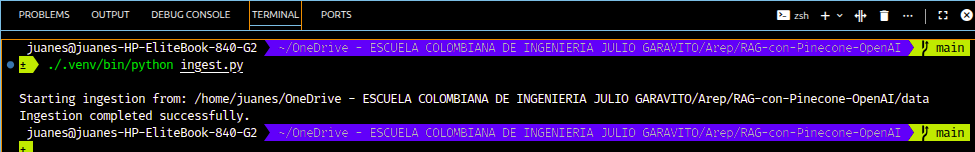
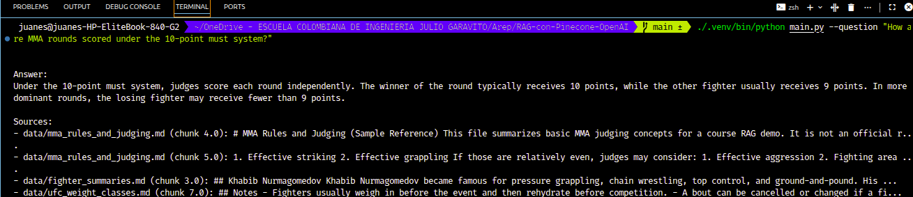
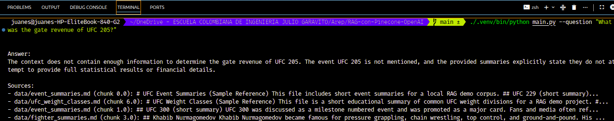
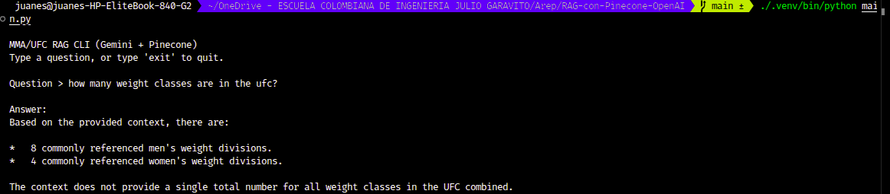

# Repository 2: LangChain RAG with Pinecone + Gemini (MMA/UFC Demo)

## 1) Project Title

LangChain RAG Project using Pinecone and Google Gemini (MMA/UFC local corpus)

## 2) Project Overview

This repository implements a minimal Retrieval-Augmented Generation (RAG) system in Python using the LangChain ecosystem.

The project:

- Loads local MMA/UFC text documents from the `data/` folder
- Splits them into chunks
- Generates embeddings with Google Gemini
- Stores vectors in Pinecone
- Retrieves relevant chunks for a user question
- Uses a Gemini chat model to answer using only the retrieved context

This project was created for **Repository 2** of the course assignment (RAG project).

## 3) Architecture and Components

### Core Components

- **LangChain (Python)**: Orchestration for splitting, retrieval, and prompt pipeline
- **Google Gemini Chat Model** (`ChatGoogleGenerativeAI`): Generates answers
- **Google Gemini Embeddings** (`GoogleGenerativeAIEmbeddings`): Creates vector embeddings
- **Pinecone**: Vector database for storing and retrieving document chunks
- **Retriever**: Fetches the most relevant chunks from Pinecone
- **RAG Prompt + Chain**: Instructs the model to answer from retrieved context and say when context is insufficient

### Simple Flow

1. `ingest.py` reads local files from `data/`
2. Documents are split into chunks
3. Chunks are embedded with Gemini embeddings
4. Chunks are stored in a Pinecone index
5. `main.py` receives a question
6. Retriever fetches relevant chunks from Pinecone
7. Gemini chat model answers using the retrieved context

## 4) Repository Structure

```text
.
├── main.py                  # CLI entrypoint for asking questions
├── ingest.py                # Ingestion/indexing pipeline (data -> chunks -> Pinecone)
├── rag_chain.py             # Shared RAG setup, Pinecone setup, retrieval, answer function
├── requirements.txt         # Python dependencies
├── .env.example             # Environment variables template
├── README.md                # Documentation (this file)
├── Assets/                  # Real screenshots captured during local execution
│   ├── ingest-success.png
│   ├── query-rules-success.png
│   ├── query-insufficient-context.png
│   └── interactive-cli.png
├── data/                    # Local UFC/MMA sample corpus (.md/.txt)
│   ├── ufc_weight_classes.md
│   ├── mma_rules_and_judging.md
│   ├── fighter_summaries.md
│   └── event_summaries.md
└── screenshots/
    └── .gitkeep             # Placeholder for submission screenshots
```

## 5) Prerequisites

- Python 3.10+ (recommended)
- A Pinecone account and API key
- A Google AI API key (for Gemini)
- Internet access when running ingestion/query (to call Pinecone and Gemini APIs)

## 6) Installation Steps

```bash
python -m venv .venv
source .venv/bin/activate
pip install -r requirements.txt
```

## 7) Environment Variables Setup (`.env`)

Create a `.env` file in the project root by copying `.env.example`:

```bash
cp .env.example .env
```

Then fill in your real API keys and preferred index name.

### Required variables

- `PINECONE_API_KEY`
- `PINECONE_INDEX_NAME`
- `GOOGLE_API_KEY`

### Optional variables (defaults exist in code)

- `PINECONE_CLOUD` (default: `aws`)
- `PINECONE_REGION` (default: `us-east-1`)
- `GEMINI_CHAT_MODEL` (default: `gemini-1.5-flash`)
- `GEMINI_EMBEDDING_MODEL` (default: `models/gemini-embedding-001`)

## 8) How to Prepare the UFC/MMA Sample Data (`data/` folder)

This repository already includes a small English demo corpus in `data/` with MMA/UFC topics:

- UFC divisions / weight classes
- MMA rules and judging
- Short fighter summaries
- Short event summaries

You can edit or replace these files with your own `.md` or `.txt` files if needed. Keep the files in English for consistent results with the demo prompt and examples.

## 9) How to Run Ingestion (`ingest.py`)

Run the ingestion script to create/connect the Pinecone index and upload document chunks:

```bash
python ingest.py
```

Example terminal output:

```text
Starting ingestion from: /path/to/repo/data
Ingestion completed successfully.
- Files loaded: 4
- Chunks indexed: 18
- Pinecone index: mma-rag-demo
```

Notes:

- The script creates the Pinecone index if it does not exist.
- The index dimension is detected dynamically from the Gemini embedding model (not hardcoded).

## 10) How to Run the RAG App (`main.py`)

### Single question mode

```bash
python main.py --question "How are MMA rounds scored under the 10-point must system?"
```

### Interactive CLI mode

```bash
python main.py
```

Type questions in the terminal. Type `exit` or `quit` to close the app.

## 11) Example Queries and Example Outputs (Text Examples)

### Example 1

Query:

```text
How are MMA rounds scored under the 10-point must system?
```

Example output (abridged):

```text
Answer:
Under the 10-point must system, the winner of a round usually gets 10 points and the other fighter receives 9 or fewer. Judges prioritize effective striking and effective grappling, then consider aggression and cage/ring control when the primary criteria are even.

Sources:
- data/mma_rules_and_judging.md (chunk 2)
- data/mma_rules_and_judging.md (chunk 1)
```

### Example 2

Query:

```text
Which UFC divisions are commonly used in the sample corpus?
```

Example output (abridged):

```text
Answer:
The sample corpus includes common UFC divisions such as lightweight, welterweight, middleweight, light heavyweight, heavyweight, and several women's divisions like strawweight and flyweight.

Sources:
- data/ufc_weight_classes.md (chunk 0)
```

### Example 3 (Insufficient context behavior)

Query:

```text
What was the gate revenue of UFC 205?
```

Example output (abridged):

```text
Answer:
I do not have enough information in the provided context to answer that question confidently.
```

## 12) Screenshots Section

The following screenshots were captured from real runs of this project and are stored in `Assets/`.

### 12.1 Ingestion Success (`ingest.py`)

Context:

- Command used: `./.venv/bin/python ingest.py`
- Purpose: Demonstrates the ingestion pipeline loading local MMA/UFC files, splitting them into chunks, and indexing them in Pinecone.
- What this proves: Pinecone connection and Gemini embeddings worked for indexing.



### 12.2 RAG Query with Valid Context (Rules/Judging)

Context:

- Command used: `./.venv/bin/python main.py --question "How are MMA rounds scored under the 10-point must system?"`
- Purpose: Demonstrates a grounded answer using the MMA judging document in the local corpus.
- What this proves: Retrieval from Pinecone and answer generation with Gemini are working end-to-end.



### 12.3 RAG Query with Insufficient Context Handling

Context:

- Command used: `./.venv/bin/python main.py --question "What was the gate revenue of UFC 205?"`
- Purpose: Tests behavior when the requested fact is not present in the local corpus.
- What this proves: The prompt and chain correctly indicate insufficient context instead of inventing unsupported information.



### 12.4 Interactive CLI Session

Context:

- Command used: `./.venv/bin/python main.py`
- Purpose: Shows the interactive terminal workflow for asking multiple questions without restarting the script.
- What this proves: The CLI mode is usable for live demos and course presentation.



Note:

- The `screenshots/` folder is kept as a placeholder in case the submission format requires copied images there, but the current screenshots included in this repository are in `Assets/`.

## 13) Notes / Limitations

- This is a **small demo corpus** for course purposes, so answers are limited to the content in `data/`.
- If a question is outside the uploaded documents, the model should indicate insufficient context.
- Re-ingesting after changing the corpus is supported, but results depend on the current contents of the Pinecone index and the generated chunk IDs.
- API usage costs may apply for Pinecone and Google Gemini depending on your account plan.

## 14) Why Gemini Was Used Instead of OpenAI

The assignment note mentions OpenAI for embeddings/LLM, but this implementation uses **Google Gemini for both chat generation and embeddings** because of cost constraints.

This still preserves the same required RAG architecture:

- LLM + embeddings provider
- Pinecone vector database
- LangChain-based retrieval and prompting pipeline

No OpenAI packages, keys, or imports are used in this repository.
